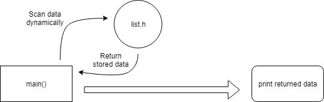
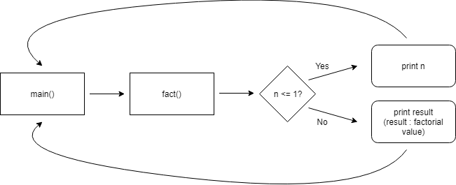

<!DOCTYPE html>
<html>

<head>
  <meta charset="utf-8">
  <meta name="viewport" content="width=device-width, initial-scale=1.0">
  <title>README</title>
  <link rel="stylesheet" href="https://stackedit.io/style.css" />
</head>

<body class="stackedit">
  
<h1 id="data_structrue">Data_Structrue</h1>

H/W of Data_Structure

<h1 id="explanation">Explanation</h1>
<ul>
<li>To understand how to work structures in C</li>
</ul>
<h1 id="nd-work">1nd work</h1>
<ul>
<li>Making Linked list by use C</li>
<li>Using structure and header file to read and understand easily</li>
<li>Using ‘malloc’ and ‘scanf’ to add data dynamically</li>
<li>Using Pointer because of the limitation of array (Array is static data. We can’t stretch it’s range dynamically)</li>
<li>‘While’ is more convenient than ‘For’ at dynamic data (If we use ‘For’, we have to make another variable. In terms of Memory, this is very wasteful.)</li>
</ul>

<ul>
<li>C를 이용해 Linked list를 구현합니다.</li>
<li>코드 자체를 쉽게 인지하고 이해하기 위해 header file을 사용합니다.</li>
<li>동적 데이터 입력을 위해 malloc과 scanf를 사용합니다.</li>
<li>배열의 한계로 인해 포인터를 사용합니다. (배열은 정적 데이터입니다. 그 범위를 자유롭게 바꿀 수 없습니다.)</li>
<li>동적 데이터를 위해 for 문 대신 while문을 사용합니다.</li>
</ul>
<h1 id="nd-work-1">2nd work</h1>
<ul>
<li>Making a Factorial code</li>
<li>By using variable ‘compare’, we can make more active code.</li>
<li>Structure ‘fact’ should be able to recognize numbers below 1 and return the results. So I added a code to return this result.</li>
</ul>

<ul>
<li>팩토리얼 코드를 구현하였습니다.</li>
<li>더 능동적인 코드를 위해 compare 변수를 사용하였습니다.</li>
<li>구조체 fact는 1 이하의 숫자를 인식하고 결과를 반환할 수 있어야 합니다. 이 결과를 반환하기 위해 if문 안에 해당 코드를 구현하였습니다.</li>
</ul>

</body>

</html>
